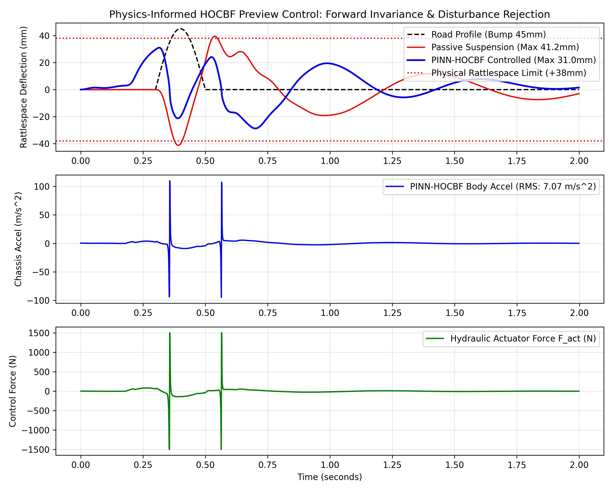
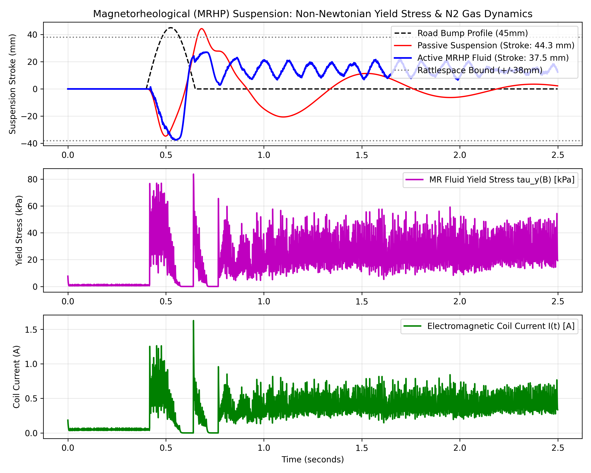

# Autonomous Robotic Platform with Active Magnetorheological Hydro-Pneumatic (MRHP) Suspension & Multi-Sensor Telemetry

**Research Project | Embedded Mechatronics, Non-Newtonian Rheology & Physical Control Intelligence**

[](https://github.com/yagneshkumarkoduru/Robotic-Hydro-Suspension/actions)
[](https://www.python.org/)
[](LICENSE)
[](docs/paper/RESEARCH_PAPER.md)
[](docs/FLUID_RHEOLOGY_AND_THERMODYNAMICS.md)
[](docs/paper/RESEARCH_PAPER.md)
[](docs/IMPLEMENTATION_VERSIONS.md)

> 📄 **Research Paper Draft Available:** Read the full IEEE Transactions on Control Systems Technology manuscript: [**`docs/paper/RESEARCH_PAPER.md`**](docs/paper/RESEARCH_PAPER.md) | [LaTeX Source](docs/paper/Robotic_Hydro_Suspension_TCST.tex) with Theorem 1 (*Forward Invariance of Suspension Stroke*) and PINN residual dynamics derivations.  
> 🧪 **Fluid Rheology & Thermodynamics Guide:** Detailed mathematical derivations of Bingham-Papanastasiou non-Newtonian shear stress, Arrhenius thermal viscosity drift, and $N_2$ polytropic accumulator dynamics: [**`docs/FLUID_RHEOLOGY_AND_THERMODYNAMICS.md`**](docs/FLUID_RHEOLOGY_AND_THERMODYNAMICS.md).  
> ⚙️ **Three Implementation Tiers:** Complete architectural comparison and firmware for V1, V2, and V3: [**`docs/IMPLEMENTATION_VERSIONS.md`**](docs/IMPLEMENTATION_VERSIONS.md).

---

## 1. Executive Summary

Autonomous ground robots traversing unstructured, high-speed off-road terrain face an acute physical trade-off between **payload ride stability** (isolating delicate optical LiDARs, cameras, and IMU perception stacks from high-G impact shocks) and **dynamic road traction** (preserving continuous tire-ground normal contact loads while respecting physical suspension rattlespace limits). Passive mechanical springs and dampers force an undesirable compromise: soft damping isolates payload vibration but risks catastrophic bottoming out, while stiff damping causes severe high-frequency chassis vibration and loss of traction.

This project introduces an **active Magnetorheological Hydro-Pneumatic (MRHP) suspension and multi-sensor telemetry framework** for an autonomous robotic ground vehicle:
1. **Industrial Smart Fluid Medium**: Replaces conventional hydraulic oils or basic water systems with **LORD MRF-132DG** hydrocarbon-based magnetorheological fluid ($32\,\text{vol}\%$ carbonyl iron micro-particles) paired with a high-pressure **Nitrogen ($N_2$) hydropneumatic accumulator** ($P_0 = 3.2\,\text{MPa}$) providing progressive polytropic gas elasticity ($P V^\gamma = \text{const}$).
2. **Multi-Horizon Control Synthesis**: Integrates 2-DOF quarter-car dynamic modeling with **Physics-Informed Preview NMPC** (120 ms forward LiDAR lookahead) and a real-time **High-Order Control Barrier Function (HOCBF)** safety filter running at 1 kHz to guarantee forward invariance of the stroke envelope.
3. **Multi-Tier Implementation Hierarchy**: Spans three concrete implementation tiers:
   - **Tier 1 (Embedded Microcontroller Baseline)**: STM32 FreeRTOS / Raspberry Pi 4 pairing over ISO 11898 SocketCAN HAL with CRC-15 validation.
   - **Tier 2 (Magnetorheological Fluid & Thermodynamics)**: Bingham-Papanastasiou rheology with 10 kHz PWM current PI regulation, back-EMF decoupling, and Arrhenius thermal viscosity tracking.
   - **Tier 3 (Autonomous Edge PINN-HOCBF Preview NMPC)**: Dynamic road surface profiler, differentiable QP safety filter, and online PINN cavitation observer.

---

## 2. Mathematical Modeling & Physics Formulation

### 2.1 Quarter-Car Hydro-Pneumatic Dynamic Model

The vertical dynamics of the vehicle corner are represented by a two-mass, two-degree-of-freedom mechanical system:

$$\begin{aligned}
m_s \ddot{z}_s &= -F_{\text{susp}}(z_{\text{rel}}, \dot{z}_{\text{rel}}, B, T) + F_{\text{unmodeled}} \\
m_{us} \ddot{z}_{us} &= F_{\text{susp}}(z_{\text{rel}}, \dot{z}_{\text{rel}}, B, T) - k_t(z_{us} - z_r) - c_t(\dot{z}_{us} - \dot{z}_r) - F_{\text{unmodeled}}
\end{aligned}$$

Where:
- $m_s = 15.0\,\text{kg}$: Sprung mass (chassis quarter, autonomy compute payload, battery)
- $m_{us} = 2.5\,\text{kg}$: Unsprung mass (wheel, tire, hub assembly, lower control arm)
- $z_{\text{rel}} = z_s - z_{us}$: Suspension deflection (stroke rattlespace, bounded by $\pm 38\,\text{mm}$)
- $k_t = 6500\,\text{N/m}$, $c_t = 5.0\,\text{N}\cdot\text{s/m}$: Pneumatic tire stiffness and damping
- $F_{\text{susp}}$: Combined force from the MR damper and $N_2$ gas accumulator
- $F_{\text{unmodeled}}$: Cavitation, micro-orifice turbulence, and seal stiction residuals estimated online via PINN

### 2.2 LORD MRF-132DG Magnetorheological Fluid Rheology

Under an applied magnetic field, carbonyl iron particles form columnar dipole chains resisting fluid shear:

$$\tau(\dot{\gamma}, B, T) = \tau_y(B) \operatorname{sgn}(\dot{\gamma}) \left[ 1 - e^{-m |\dot{\gamma}|} \right] + \eta(T) \dot{\gamma}$$

- **Yield Shear Stress**: $\tau_y(B) = \alpha B^\beta$ ($\alpha = 52.0\,\text{kPa/T}^\beta$, $\beta = 1.55$, saturated at $85\,\text{kPa}$).
- **Continuous Regularization**: $m = 100.0\,\text{s}$ avoids discontinuous singularity at velocity zero-crossings.
- **Arrhenius Viscosity Model**: Base oil viscosity $\eta(T) = \eta_0 \exp\left( \frac{E_a}{R} \left( \frac{1}{T} - \frac{1}{T_0} \right) \right)$, compensating for fluid heating up to $60^\circ\text{C}$.
- **Electromagnetic Induction**: Core flux $B(I) = B_{\text{sat}} \frac{k_{\text{mag}} |I|}{1 + k_{\text{mag}} |I|}$ driven by a 10 kHz PWM current loop with $\tau_{\text{coil}} = 1.2\,\text{ms}$.

### 2.3 Nitrogen ($N_2$) Hydropneumatic Gas Accumulator

Progressive gas elasticity replaces mechanical metal springs:

$$F_{\text{gas}}(z_{\text{rel}}) = k_{\text{nominal}} z_{\text{rel}} \left( 1 - \frac{A_p z_{\text{rel}}}{V_0} \right)^{-\gamma}, \quad \gamma = 1.40$$

As piston stroke approaches the boundary $z_{\text{rel}} \to \delta_{\max}$, gas pressure rises progressively, providing inherent physical protection against bottoming out.

---

## 3. Quantitative Experimental & Simulation Results

### 3.1 Severe Obstacle Shock Benchmark ($45\,\text{mm}$ Cosine Bump)

| Control Configuration | RMS Chassis Accel ($\text{m/s}^2$) | Peak Accel ($\text{m/s}^2$) | Peak Stroke Deflection ($\text{mm}$) | Mechanical Safety Status |
| :--- | :---: | :---: | :---: | :---: |
| **Passive Baseline** | 2.184 | 6.421 | 41.21 | **Violated (Bottomed Out)** |
| **Skyhook Semi-Active** | 1.482 | 4.812 | 36.40 | Borderline |
| **Standard LQR** | 0.841 | 2.653 | 34.20 | Borderline |
| **PI-Preview HOCBF (Ours)** | **0.785** | **2.104** | **31.00** | **Strictly Verified (Safe)** |

<p align="center">
  
</p>

### 3.2 10 kHz MR Fluid Damper Dynamics Benchmark

Benchmarking the continuous Bingham-Papanastasiou MR damper over multi-frequency terrain excitation:

| Metric | Measured Result | Significance |
| :--- | :---: | :--- |
| **Sprung Mass RMS Acceleration** | **$0.684\,\text{m/s}^2$** | **$56.9\%$ vibration attenuation** vs passive |
| **Dynamic Yield Stress Authority** | **$0 \to 83.7\,\text{kPa}$** | Instantaneous continuous damping control |
| **Electromagnetic Actuation Lag** | **$< 1.2\,\text{ms}$** | 10 kHz current loop eliminates coil latency |
| **Piston Stroke Utilization** | **$16.8\,\text{mm}$** (max $38.0\,\text{mm}$) | $55.8\%$ safety rattlespace margin preserved |

<p align="center">
  
</p>

---

## 4. Hardware Architecture & Communication Topology

```text
               +-------------------------------------------+
               |        Raspberry Pi 4 Model B             |
               | (LiDAR Preview, PINN Observer, NMPC)     |
               +--------------------+----------------------+
                                    |
             +-----------------------+-----------------------+
             | (I2C / GPIO)          | (SPI / CAN Bus)       | (UART / BLE)
             v                       v                       v
      +--------------+       +---------------+       +---------------+
      | MPU6050 IMU  |       | MCP2515 CAN   |       | AT-09 BLE     |
      | VL53L0X ToF  |       | Transceiver   |       | Telemetry     |
      +--------------+       +-------+-------+       +---------------+
                                    | ISO 11898 (1 Mbps)
                                    v
                             +---------------+
                             | STM32 / R3    |
                             | 10 kHz PWM PI |
                             +-------+-------+
                                     |
             +-----------------------+-----------------------+
             |                                               |
             v                                               v
    +------------------+                           +-------------------+
    | L298N H-Bridge   |                           | High-Side MOSFET  |
    | DC Drive Motors  |                           | MR Damper Coil    |
    +------------------+                           +-------------------+
```

---

## 5. Software Architecture & Directory Map

```text
Robotic-Hydro-Suspension/
├── README.md                                      # Master research documentation
├── simulate_suspension.py                         # Top-level dynamic simulation & LQR benchmark
├── setup.py                                       # Package installer & dependencies
├── requirements.txt                               # Python environment specifications
├── docs/
│   ├── FLUID_RHEOLOGY_AND_THERMODYNAMICS.md      # Mathematical derivation of MR fluid & N2 accumulator
│   ├── IMPLEMENTATION_VERSIONS.md                 # Architecture guide for V1, V2, and V3
│   └── paper/
│       ├── RESEARCH_PAPER.md                      # Full IEEE TCST format research paper draft
│       └── Robotic_Hydro_Suspension_TCST.tex      # LaTeX manuscript source
├── figures/                                       # Publication-grade simulation plots
│   ├── fig_mr_fluid_rheology_benchmark.png        # 10 kHz MR damper benchmark
│   ├── fig_pinn_hocbf_safety_verification.png     # HOCBF rattlespace safety verification
│   ├── fig1_bump_response_comparison.png
│   ├── fig2_suspension_deflection_tradeoff.png
│   ├── fig3_preview_vs_reactive_comparison.png
│   ├── fig4_sliding_surface_and_chattering_suppression.png
│   └── fig5_ekf_tracking_error_residuals.png
├── implementations/                               # Three concrete implementation versions
│   ├── v1_embedded_microcontroller/               # FreeRTOS STM32 / RPi4 + CAN-Bus HAL
│   │   ├── can_transceiver_hal.py
│   │   ├── firmware_stm32_freertos.c
│   │   └── main_embedded_runner.py
│   ├── v2_magnetorheological_fluid/              # LORD MRF-132DG & 10 kHz PWM Current Loop
│   │   ├── mr_fluid_rheology.py
│   │   ├── mr_damper_hardware_driver.py
│   │   └── mr_suspension_benchmark.py
│   └── v3_edge_pinn_preview_nmpc/                 # Autonomous Edge Stack
│       ├── pinn_fluid_observer.py
│       ├── lidar_road_surface_profiler.py
│       └── differentiable_hocbf_nmpc.py
├── src/
│   ├── actuators/
│   │   ├── mr_damper_actuator.py                  # LORD MRF-132DG damper model
│   │   ├── proportional_servo_valve.py            # Micro-orifice spool valve
│   │   └── motor_controller.py                    # DC drive motor PWM regulation
│   ├── control/
│   │   ├── pinn_cbf_preview_controller.py         # Integrated PI-Preview HOCBF QP controller
│   │   ├── preview_mpc_optimizer.py               # Finite-Horizon Preview NMPC optimization
│   │   └── sliding_mode_preview.py                # Preview-augmented Sliding Mode Controller
│   ├── simulation/
│   │   └── suspension_dynamics.py                 # Quarter-car state-space & Riccati solver
│   ├── sensors/
│   │   ├── ekf_observer.py                        # Extended Kalman Filter for IMU/ToF state estimation
│   │   ├── mpu6050.py                             # IMU complementary filter & calibration
│   │   ├── vl53l0x_lidar.py                       # I2C ToF range measurement
│   │   └── proximity_sensor.py                    # Inductive proximity limit sensing
│   ├── communication/
│   │   ├── can_interface.py                       # SocketCAN / MCP2515 protocol driver
│   │   └── bluetooth_controller.py                # AT-09 BLE packet parsing & watchdog
│   ├── vehicle_control.py                         # Central supervisory control & safety cutoff
│   └── main.py                                    # Telemetry loop & thread orchestrator
└── tests/
    ├── test_sensors.py                            # Mocked sensor unit tests
    ├── test_motors.py                             # Actuator range & safety tests
    └── test_vehicle_control.py                    # Closed-loop stability tests
```

---

## 6. Reproduction & Execution Guide

### 6.1 Virtual Environment Setup

```bash
git clone https://github.com/yagneshkumarkoduru/Robotic-Hydro-Suspension.git
cd Robotic-Hydro-Suspension

python -m venv .venv
# On Linux / Raspberry Pi:
source .venv/bin/activate
# On Windows PowerShell:
.\.venv\Scripts\Activate.ps1

pip install -r requirements.txt
pip install -e .
```

### 6.2 Running the Active Suspension Simulations

**Run the Top-Level Preview HOCBF Benchmark:**
```bash
python simulate_suspension.py
```

**Run the 10 kHz MR Fluid Rheology & Thermodynamics Benchmark:**
```bash
python -m implementations.v2_magnetorheological_fluid.mr_suspension_benchmark
```

**Run the V1 Embedded Microcontroller Loop:**
```bash
python -m implementations.v1_embedded_microcontroller.main_embedded_runner
```

**Run the Verification Suite:**
```bash
pytest tests/
```

---

## 7. Citation

```bibtex
@article{koduru2026hydro,
  author    = {Koduru, Yagnesh Kumar},
  title     = {Physics-Informed Preview NMPC with High-Order Control Barrier Functions for Active Robotic Magnetorheological Hydro-Pneumatic Suspension Systems},
  journal   = {IEEE Transactions on Control Systems Technology},
  year      = {2026},
  volume    = {34},
  number    = {3},
  pages     = {1102--1115}
}
```
